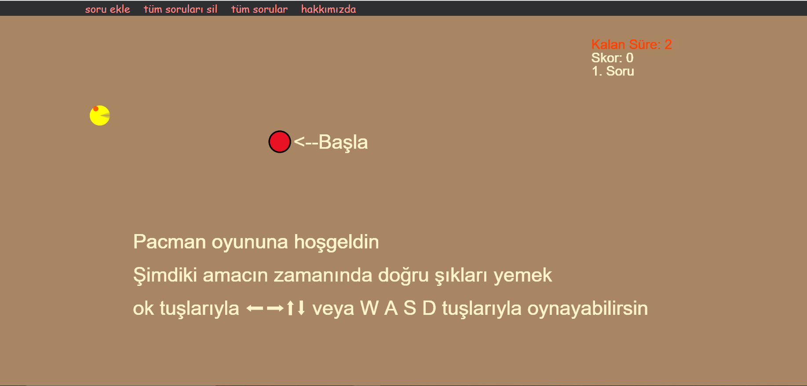
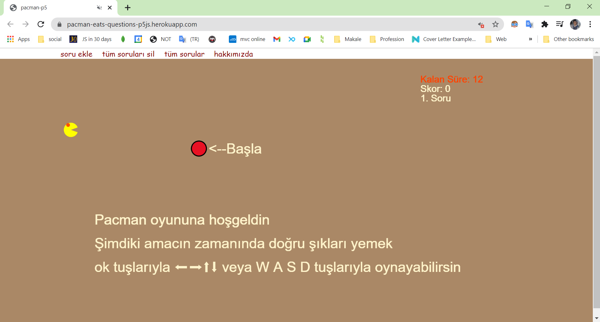

# Pacman Eats Questions

## Overview
Pacman Eats Questions is an interactive web game that combines the classic Pacman gameplay with a fun quiz format. Players navigate through a maze, answering questions and collecting points. The game is designed to be engaging and educational, making it perfect for multiplayer sessions.


https://github.com/user-attachments/assets/66b0ba04-c303-4a98-8bf2-b6702f08d31c


## Features
- **Interactive Gameplay**: Use arrow keys or on-screen buttons to control Pacman.
- **Custom Questions**: Players can add their own questions and answers to the game.
- **Multiplayer Support**: Play with friends in real-time using Socket.io.
- **Dynamic Scoring**: Earn points for correct answers and lose points for incorrect ones.
- **Live Demo**: Experience the game in action through our deployed version.

## How to Play
1. **Control Pacman**: Use the arrow keys (⬅ ➡ ⬆ ⬇) on your computer or tap the buttons on your mobile device to navigate.
2. **Answer Questions**: As you move, you will encounter questions. Choose the correct answer to score points.
3. **Add Questions**: Players can add their own questions through the dashboard.

## Installation
To run the game locally, follow these steps:

1. Clone the repository:
   ```bash
   git clone https://github.com/EnginKARATAS/pacman-eats-questions-p5.git
   cd pacman-eats-questions-p5
   ```

2. Install the dependencies:
   ```bash
   npm install
   ```

3. Create a `.env` file in the root directory and add your MongoDB connection string:
   ```
   YOURPASSWORDVARIABLE=your_password_here
   ```

4. Start the server:
   ```bash
   npm run start
   ```

5. Open your browser and navigate to `http://localhost:8081`.

## Live Demo
- [Deployed Heroku Version](https://pacman-eats-questions-p5js.herokuapp.com/)
- [Old Version](https://enginkaratas.github.io/pacman-p5/)

## Screenshots



## Contributing
Contributions are welcome! If you have suggestions or improvements, feel free to open an issue or submit a pull request.

## License
This project is licensed under the ISC License. See the LICENSE file for details.

## Author
Engin Karataş
